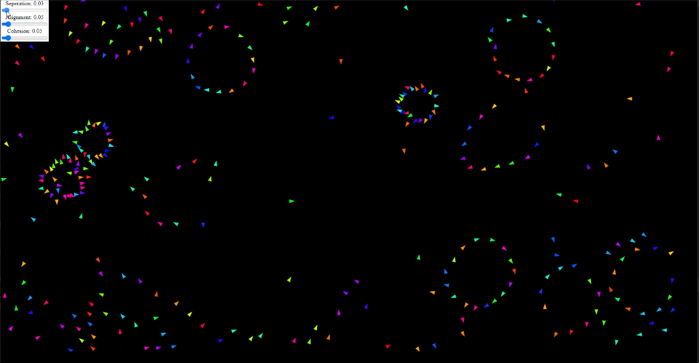
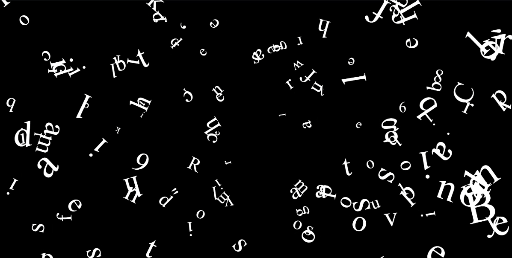
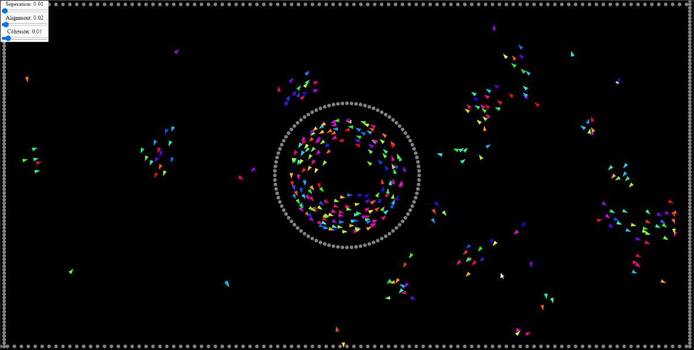
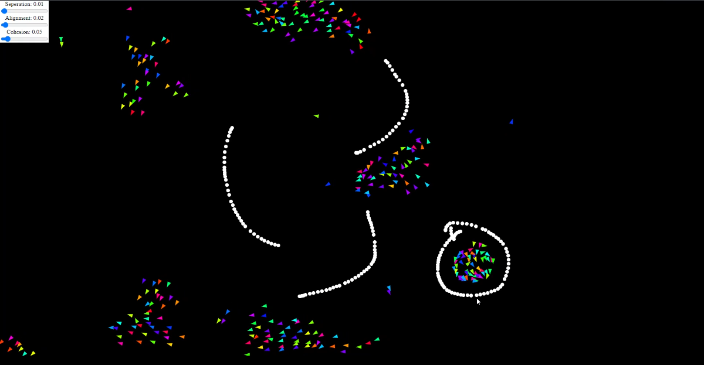

 
 
 

<h1 align="center">Boids - Luke Cordova</h1>

Boids is a project that enables front end web designs to more easily incorporate boid-like animations.
 

## What are Boids?

"Boids" is a simulation that imitates a flock like organization of individual boid, or bird-oid/bird-like objects. It can be used to simulate various flocking animals, most commonly birds or fish, but can also describe stampeding herds and even crowds of humans. In real world application, boid technology is used for CGI animations, video games, and drone swarming. If you have ever watched Finding Nemo, you have seen boids!

## How do Boids work?
The boids algorithm adheres to 3 rules, **Seperation**, **Alignment**, and **Cohesion**. All boids have a line of sight and can "see" both a variable distance away from them selves and a variable amount of degrees around themselves. If an individual boid can see another boid, it will adhere to the three rules stated above in the following manner.
- **Seperation**: Each boid will steer away from another boid within it's line of sight. The closer a boid is, the more it will steer away. 
- **Alignment**: Each boid will steer towards the same average direction of all boids in its line of sight.
- **Cohesion**: Each boid will steer towards the average center of all boids in it's line of sight.

These three rules are enough to create a fully functioning flocking simulation. This being said, more rules can be added to make the boids algorithm more creative and fun! Rules that describe how a boid will react to obstacles, predators, and different forces can make the simulation more spectacular.
 
 

## Here are some visuals of this project.
 

### **Seperation, Alignment, and Cohesion demo**

This demo shows the relation ship that each rule has and what happens when you change the weights associated with each rule.

### **Text boids**

I made a rule that forces boids to steer towards a given position on the screen to create an interesting text animation.

### **Obstacle avoidance**

These videos show how boids can both adhere to their rules and to the new rule of steering away from obstacles.

